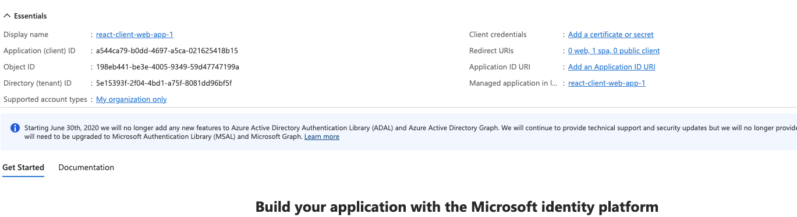
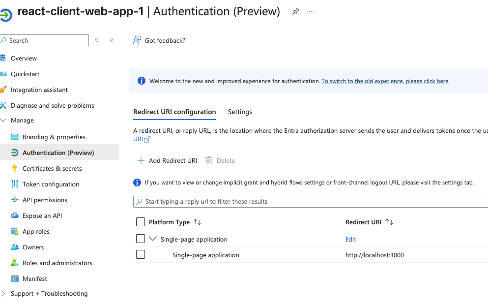
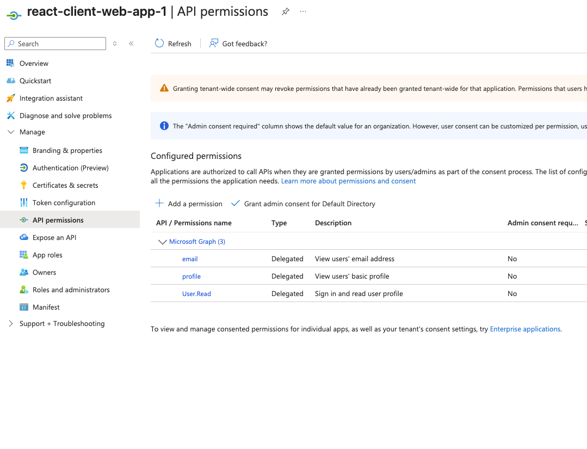

# React Client Web App with Azure Entra ID

This app demonstrates authentication using Azure Entra ID (Microsoft Identity Platform) in a React app.
After login, it displays the access token, ID token, their decoded contents, and fetches user details from Microsoft Graph API.

## Features

- Login with Azure Entra ID
- View raw and decoded access & ID tokens
- Fetch and display user name and email from Microsoft Graph API
- Copy the Graph API curl command to clipboard
- Logout

## Usage

1. Install dependencies:

   ```bash
   npm install
   ```

2. Update `src/authConfig.js` with your Azure Entra ID client and tenant IDs.

3. Start the app:

   ```bash
   npm run dev
   ```

4. Open [http://localhost:3000](http://localhost:3000) in your browser.

## Example Graph API curl command

After login, you can copy and use the following command to fetch your user details:

```bash
curl -H "Authorization: Bearer <ACCESS_TOKEN>" https://graph.microsoft.com/v1.0/me
```

Replace `<ACCESS_TOKEN>` with your actual token from the app.


# Entra ID setup

1. Created a app regsistration in Azure Entra ID. with following details:
   - Name: React Client Web App
   - Supported account types: Accounts in this organizational directory only (Single tenant)
   - Redirect URI: http://localhost:3000

   

   

   


Web app 

